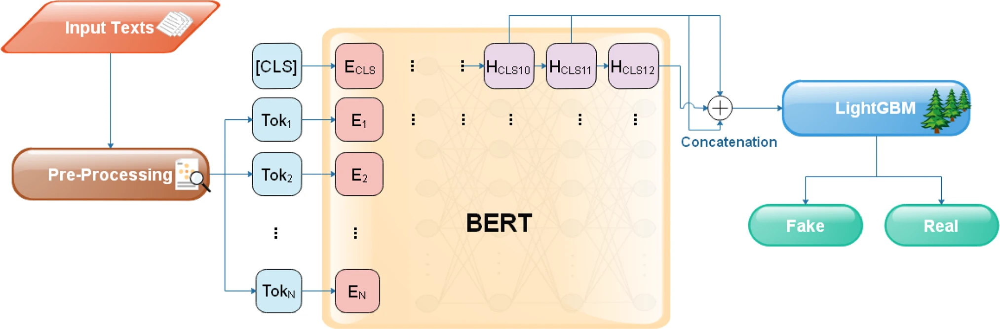

# Fake News Detection using BERT and LightGBM 

## Overview
This project is centered around the development of a Fake News Detection system, leveraging the power of BERT and LightGBM. The approach involves integrating BERT embeddings into the system and enhancing its capabilities by incorporating gradient boosting through LightGBM. Additionally, the project includes a thorough examination of the model's performance in comparison to other traditional machine learning models.

## Dataset 
<a href='https://github.com/KaiDMML/FakeNewsNet/tree/maste'>
FakeNewsNet</a>

<a href="https://www.kaggle.com/datasets/emineyetm/fake-news-detection-datasets/data">
ISOT </a>

## Main Idea

## Experiment

Result on ISOT Dataset
| **Model**           | **Accuracy %** | **Precision %** | **Recall %** | **F1 score %** |
|---------------------|----------------|-----------------|--------------|----------------|
| Decision Tree       | 91.11          | 91.13           | 91.11        | 91.11          |
| Naive Bayes         | 92.23          | 92.26           | 92.23        | 92.22          |
| Logistic Regression | 94.19          | 94.23           |     94.19    | 94.19          |
| LightGBM            | 93.34          | 93.53           | 93.43        | 94.43          |
| KNN                 | 61.20          | 73.38           | 61.20        | 56.42          |
| SVM                 | 94.20          | 94.25           | 94.20        | 94.20          |
| Random Forest       | 94.09          | 94.09           | 94.09        | 94.09          |
| BERT + LightGBM     | 98.63          | 98.79           | 98.55        | 98.67          |

